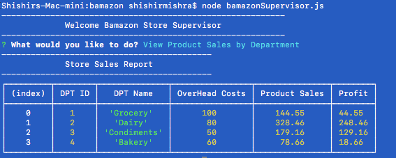

# Welcome to Bamazon!

**Bamazon** is POS (point of sales) and store management application written in NodeJS.

There are 3 main applications/functions of the bamazon app.

## POS for Customers

Customers can use this app to shop at bamazon by entering the item ID and QTY. Here is how:

**To Start POS**

```
node bamazonCustomer
```


## For Managers @ Bamazon

Managers can perform multiple functions using this app such as viewing and updiatng inventory, adding a new product etc.

**To Start manager App**

```
node bamazonManager
```


## For Supervisor @ Bamazon

A supervisor can add a new department or view their sales performance. Here is an example.

**To Start Supervisor App**

```
node bamazonSupervisor
```





A complete flow of how things happen at Bamazon are presented with this flow.


